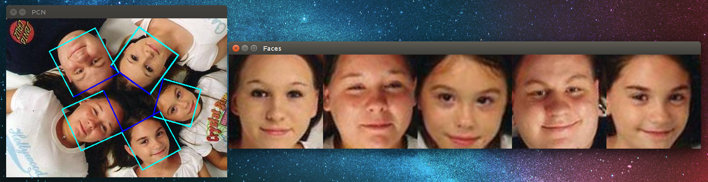
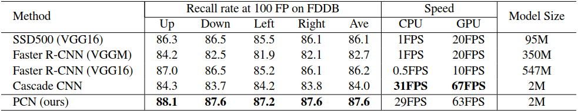

# News

* [PyTorch implementation](https://github.com/siriusdemon/pytorch-PCN) available, thank Sirius Demon!

* [Tracking](video.cpp) released, achieving 400FPS on CPU! 

> 

* [CropFace function](crop.cpp) released! 

> 

# Real-Time Rotation-Invariant Face Detection with Progressive Calibration Networks

Progressive Calibration Networks (PCN) is an accurate rotation-invariant face detector running at real-time speed on CPU. This is an implementation for PCN.


### Results

Some detection results can be viewed in the following illustrations:


PCN is designed aiming for low time-cost. We compare PCN's speed with other rotation-invariant face detectors' on standard VGA images(640x480) with 40x40 minimum face size. The detectors run on a desktop computer with 3.4GHz CPU, GTX Titan X. The speed results together with the recall rate at 100 false positives on multi-oriented FDDB are shown in the following table. Detailed experiment settings can be found in our paper. It is worth mentioning that converting the square results to rectangles or ellipses is helpful to fit the ground-truth data. In this way, better accuracy can be achieved. But we do not convert the results here.



### Usage

Set minimum size of faces to detect (`size` >= 20)

- `detector.SetMinFaceSize(size);`
  
Set scaling factor of image pyramid (1.4 <= `factor` <= 1.6)
  
- `detector.SetImagePyramidScaleFactor(factor);`
  
Set score threshold of detected faces (0 <= `thresh1`, `thresh2`, `thresh3` <= 1)
  
- `detector.SetScoreThresh(thresh1, thresh2, thresh3);`

Smooth the face boxes or not (smooth = true or false, recommend using it on video to get stabler face boxes)
  
- `detector.SetVideoSmooth(smooth);`

See [picture.cpp](picture.cpp) and [video.cpp](video.cpp) for details. If you want to reproduce the results on FDDB, please run [fddb.cpp](fddb.cpp). You can rotate the images in FDDB to get FDDB-left, FDDB-right, and FDDB-down, then test PCN on them respectively. 

Compile and run:
```Shell
cd $PCN_ROOT
# You should set "CAFFEROOT" in lib.sh, compile.sh, and run.sh first. 
sh lib.sh
sh compile.sh picture/crop/video/fddb
sh run.sh picture/crop/video/fddb
```

### Links

* [paper](https://arxiv.org/pdf/1804.06039.pdf)

### Prerequisites

* Linux
* Caffe
* OpenCV (2.4.10, or other compatible version)

### Other Implementations

* [PyTorch](https://github.com/siriusdemon/pytorch-PCN) (by siriusdemon)
* [IOS](https://github.com/elhoangvu/PCN-iOS) (by elhoangvu)
* [NCNN](https://github.com/HandsomeHans/PCN-ncnn) (by HandsomeHans)
* [OpenCV](https://github.com/richipower/PCN-opencv) (by richipower)
* [Windows](https://github.com/imistyrain/PCN-Windows) (by imistyrain)
* [ETOS](https://github.com/etosworld/etos-facedetector) (by etosworld)

### FAQs

* How to get faces with different rotation-in-plane angles before training?
  
  Please refer to issue [3](https://github.com/Jack-CV/PCN-FaceDetection/issues/3), [7](https://github.com/Jack-CV/PCN-FaceDetection/issues/7), [8](https://github.com/Jack-CV/PCN-FaceDetection/issues/8), [10](https://github.com/Jack-CV/PCN-FaceDetection/issues/10).

### Citing PCN

If you find PCN useful in your research, please consider citing:

    @inproceedings{shiCVPR18pcn,
        Author = {Xuepeng Shi and Shiguang Shan and Meina Kan and Shuzhe Wu and Xilin Chen},
        Title = {Real-Time Rotation-Invariant Face Detection with Progressive Calibration Networks},
        Booktitle = {The IEEE Conference on Computer Vision and Pattern Recognition (CVPR)},
        Year = {2018}
    }
