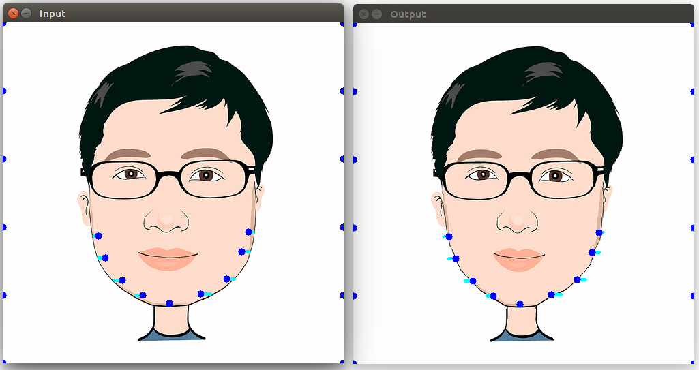
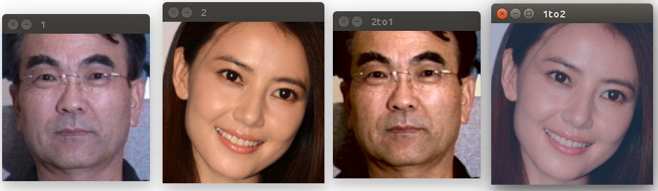

### [Real-Time Rotation-Invariant Face Detection and Tracking](PCN/)

### [Face Warping](Warping/)

### [Face Smoothing](SmoothSkin/)

### [Face Color Transfer](Color/)

### License

This code is distributed under the [BSD 2-Clause license](LICENSE).

### Contact

xuepeng.shi@vipl.ict.ac.cn

